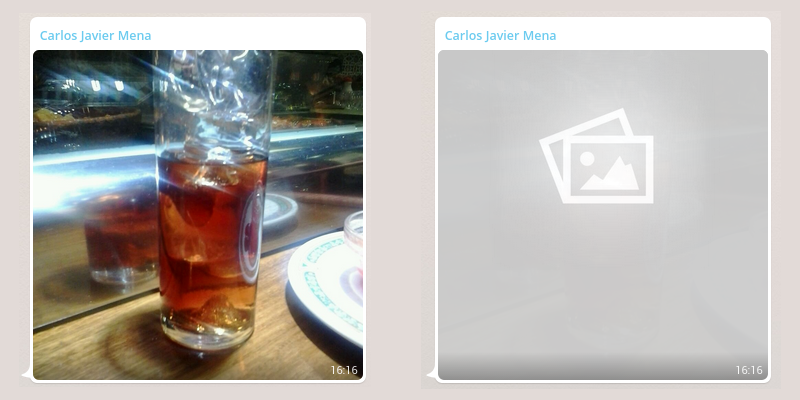

## webwhatsapp_hide_previews.user.js
When using the new web version of whatsapp, the image previews are quite big and can lead to private pictures/videos being seen by others. 
With this script, the previews will be almost invisible, and you'll need to manually click on it to view the original image/video.

If you try hard enough, you'll be able to see some shapes in the image, which will help you decide if you should open it or not.

### Before and after
